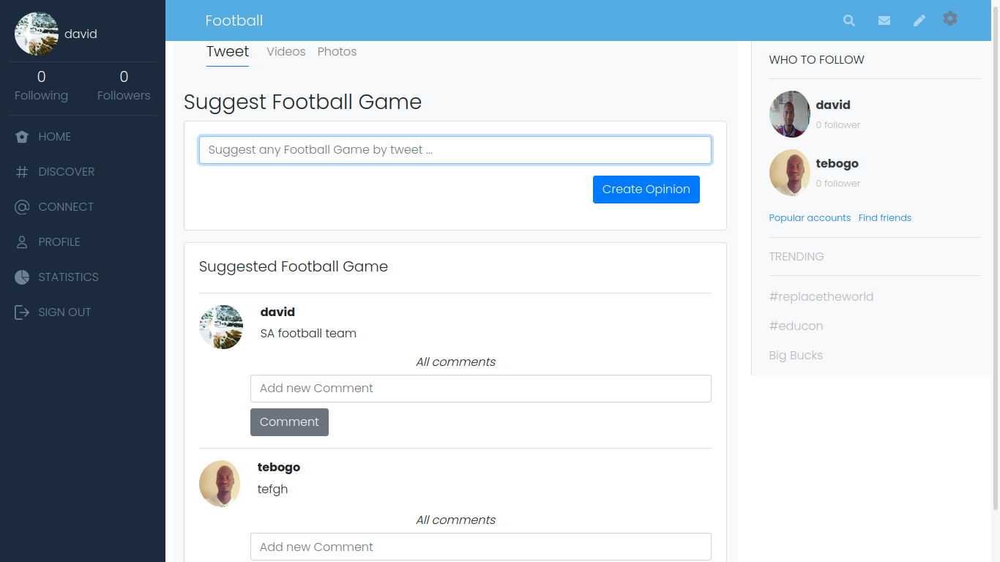

# Ruby on Rails Capstone Project.

In this project, I redesigned a twitter to create opinions about football games. I used a lot of knowledge acquired throughout the Ruby on Rails section, Model/View/Controller concepts, some of bootstrap from previous HTML & CSS, among other knowledge acquired on Microverse to create an MVP for this app.

## Acknowledgements
Design idea was inspired by Gregoire Vella on Behance

## Screenshot of the page


## Built With

   - Ruby,
   - Ruby on Rails,
   - SCSS,
   - Bootstrap,
   - Font Awesome,
   - RSpec(Testing)
   - Capybara(Testing)
   - Bullet(Developing)

## Getting Started

You can get a local copy of the repository please run the following commands on your terminal:

```
$ cd <folder>

$ git clone https://github.com/TSHEPO-CLOUD/Twitter_redesign/tree/feature-branch
```

You need to install the required gems:

```
$ bundle install or bundle update
```
```
$ yarn install
```

```
$ Migrate the database
```

```
$ rails db:migrate
```

If you want to prepopulate the database you can run the seed.rb file(not required):

```
$ rails db:seed
```

And run the server:

```
$ rails s
```


To navigate on the app you can enter http://localhost:3000/ on your browser, set a new User and you are ready to log in.

## Tests

The tests were created with RSpec, to run the tests you should open the app folder on console and run 
 
```
$   rspec --format documentation
```
## Live Demo

[Live Demo Link](https://mysterious-falls-70338.herokuapp.com/)

## Video Presentation

[Project Presentation](https://www.loom.com/share/fa6d0c2622314d7ab5d077a80a1a4a69)

## Button to deploy in heroku 

[](https://heroku.com/deploy)

👤 **Author**

👤 **TSHEPO DAVID MOLEFE**

- GitHub: [@githubhandle](https://github.com/TSHEPO-CLOUD)
- Twitter: [@twitterhandle](https://twitter.com/tshepomolefem)
- LinkedIn: [LinkedIn](https://www.linkedin.com/in/tshepo-molefe-8153313b)


## 🤝 Contributing

Contributions, issues and feature requests are welcome!

Feel free to check the [issues page](issues/).

## Show your support

Give a ⭐️ if you like this project!
